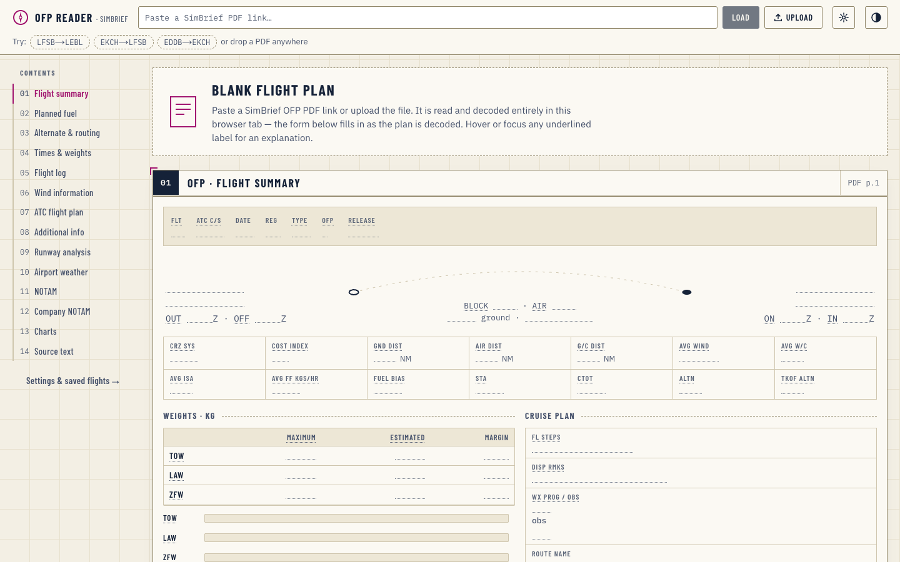
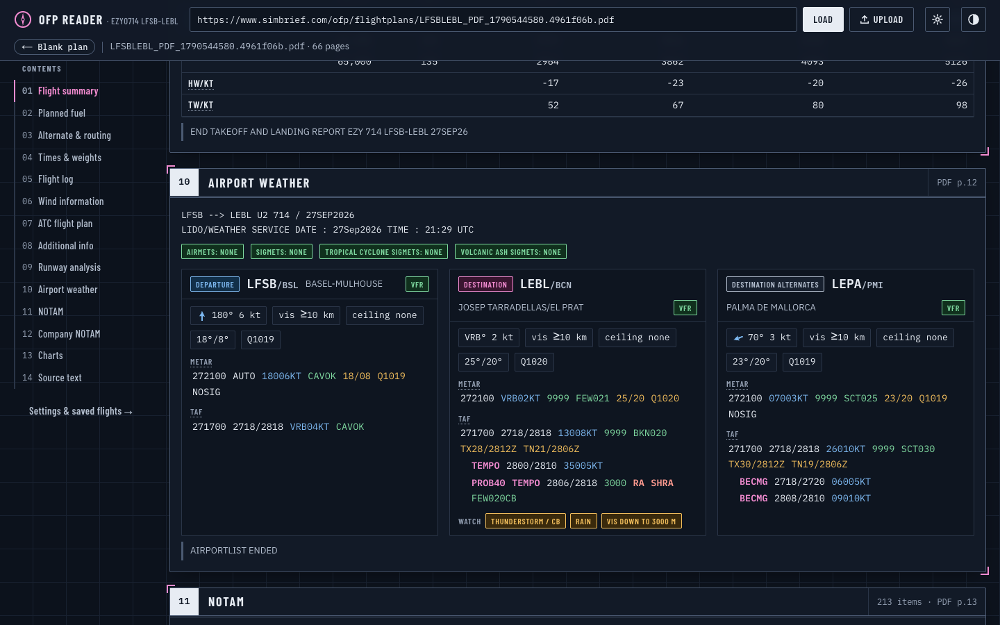

<div align="center">

# ✈︎ OFP Reader

**Turn a SimBrief operational flight plan into an interactive pilot chart, right in your browser.**

Paste a SimBrief PDF link or drop the file. The plan is decoded locally, laid out in the same order as the OFP,
and every value gets context: derived margins, decoded weather, a vertical profile, a route map and fillable actuals.


</div>

---

## Contents

- [Highlights](#highlights)
- [Screenshots](#screenshots)
- [Getting started](#getting-started)
- [Using it](#using-it)
- [How it works](#how-it-works)
- [Saved data](#saved-data)
- [Project structure](#project-structure)
- [Accessibility](#accessibility)
- [Limitations](#limitations)
- [Disclaimer](#disclaimer)

## Highlights

- **No server, no uploads.** The PDF is fetched straight from SimBrief (which allows cross-origin requests) or read from a local file, then parsed with [pdf.js](https://mozilla.github.io/pdf.js/) in the browser. The app is a static site.
- **Every section of the OFP, in OFP order.** Summary, fuel, alternate & routing, times & weights, flight log, winds, ICAO flight plan, runway analysis (TLR), airport weather, NOTAMs, company NOTAMs, the attached charts, and the full source text.
- **A blank form first.** On load you see the whole plan as an unfilled template; values ink in as the PDF is decoded.
- **Smart, not just pretty.**
  - Fuel: block composition bar, landing fuel, margin above ALTN + FINRES, endurance, burn per NM, PIC extra → total fuel.
  - Weights: max vs estimated gauges, and whether the take-off weight is actually landing-weight limited.
  - Times: taxi / airborne / block durations, local UTC offsets, and a **planned vs actual timeline** on a shared clock.
  - Flight log: vertical profile with MORA terrain, fuel on board and minimum-fuel line, a route map from the waypoint coordinates, FIR crossings, and a navigation log where ETOs follow your actual take-off time.
  - Runway analysis: V-speed cards, FLEX, head- and crosswind components for the planned runway, and factored landing distance against runway length.
  - Weather: METAR / TAF decoded token by token, flight category (VFR → LIFR) and hazard flags.
  - NOTAMs: search, category filters, "critical" (CLSD, U/S, NOT AVBL…) and "mentions my planned runway" filters.
- **Hover (or focus) to learn.** Almost every label explains itself: OFP abbreviations, ICAO equipment and PBN codes, METAR groups, TLR columns.
- **Fill it in as you fly.** Actual times, weights, ATIS, clearance, RVSM check, ATO / AFOB per waypoint, TLR actuals: all saved per flight in your browser.
- **Reopens instantly.** Each PDF is kept locally, so returning to a plan (same link, reload, recent chip or Settings) doesn't download it again.
- **Day and night themes**, both meeting WCAG AA contrast.

## Screenshots

| Blank template | Flight log (night theme) |
| --- | --- |
|  |  |

| Airport weather | Settings & saved flights |
| --- | --- |
|  |  |

**Planned vs actual timeline**


## Getting started

Requires **Node 20+** and **pnpm**.

```bash
pnpm install
pnpm dev          # http://localhost:3000
```

Production build (a fully static site in `./out`, deployable to any static host):

```bash
pnpm build
```

| Script | What it does |
| --- | --- |
| `pnpm dev` | Dev server (copies the pdf.js worker into `public/` first) |
| `pnpm build` | Static export to `out/` |
| `pnpm lint` | ESLint |
| `pnpm typecheck` | TypeScript, no emit |

> To open the dev server from another device on your network, add its address to `allowedDevOrigins` in `next.config.ts`.

## Using it

| To… | Do this |
| --- | --- |
| Load a plan | Paste a SimBrief PDF link and press **Load**, click **Upload**, or drop a PDF anywhere on the page |
| Share or bookmark a plan | Use the address bar: `/?ofp=<simbrief pdf url>` |
| Reopen a saved plan | Click a **Recent** chip, or **Open** in Settings (`/?flight=<id>`) |
| Get a fresh copy from SimBrief | **Re-download** in the status row |
| Start over | **← Blank plan** |
| Inspect a waypoint | Hover the profile, map or a nav-log row, or focus a chart and use the arrow keys |
| Manage saved data | ⚙ **Settings**: saved flights, stored entries, export JSON, delete, theme |

## How it works

```
PDF (link or file)
   │  pdf.js: text items with x/y positions
   ▼
lines.ts   snaps every item to the OFP's fixed-pitch character grid → exact columns
   ▼
parse.ts   splits by [ OFP ] / [ NOTAM ] … headers and parses each block → typed model (types.ts)
   ▼
sections/* one React component per OFP section, in PDF order
```

- SimBrief OFPs are typeset in a monospaced font, so rebuilding the character grid recovers the original columns exactly. The flight log, for example, is read by column position rather than by guessing at whitespace.
- Image-only pages (route map, wind charts, cross-section) are rendered to canvas, auto-cropped, and shown in the **Charts** section.
- The **Source text** section keeps every extracted line, searchable, so nothing on the OFP is lost even where the parser has no dedicated view.

## Saved data

Everything stays in the browser. Nothing is sent anywhere.

| What | Where | Key |
| --- | --- | --- |
| Form entries + flight details | `localStorage` | `ofp-reader:flight:<id>` (index: `ofp-reader:flights`) |
| The PDF itself | IndexedDB `ofp-reader` → `pdfs` | `<id>` |
| Theme preference | `localStorage` | `ofp-theme` |

**One record per flight plan.** The id is `FLIGHT_DATE_ROUTE_OFPn`, e.g. `EZY0714_27SEP2026_LFSBLEBL_OFP1`. Flight numbers repeat daily, so the date and route are part of the key, and each re-release (new OFP number) gets its own storage. Plans without a flight or OFP number fall back to a fingerprint of the OFP's first page, which includes the release time.

Clearing site data or using a private window removes everything; **Export JSON** in Settings keeps a copy.

## Project structure

```
src/
├── app/
│   ├── layout.tsx            fonts, theme boot script
│   ├── page.tsx              reader
│   ├── settings/page.tsx     settings
│   └── globals.css           design tokens (day / night) and all styles
├── components/
│   ├── OfpApp.tsx            loading, status row, form state
│   ├── SettingsApp.tsx       saved flights, stored data, appearance, storage
│   ├── chrome.tsx            brand, theme toggle, contents rail
│   ├── TooltipLayer.tsx      one floating tooltip for every [data-tip]
│   ├── ui.tsx                Section, Field, V (value / blank), Tip, Gauge, Act (input)
│   ├── context.tsx           OFP + saved-field contexts (useField)
│   └── sections/             Summary, Fuel, Route, TimesWeights, FlightLog, Winds,
│                             Fpl, Additional, Tlr, Wx, Notams, Charts, Source
└── lib/
    ├── ofp/
    │   ├── lines.ts          pdf.js items → monospaced lines
    │   ├── parse.ts          lines → OFP model
    │   ├── types.ts          the OFP model
    │   ├── pdf.ts            fetch / read / chart rendering (browser)
    │   ├── metar.ts          METAR / TAF decoding, flight category, wind components
    │   ├── glossary.ts       tooltip text, ICAO equipment / PBN tables
    │   └── format.ts         time, number and unit helpers
    ├── storage.ts            per-flight localStorage records
    └── pdfCache.ts           per-flight PDF copies in IndexedDB
```

**Stack:** Next.js 16 (static export) · React 19 · TypeScript · pdf.js 6. No UI framework; styles are plain CSS with design tokens.

## Accessibility

- Every text / background pair meets **WCAG AA (≥ 4.5 : 1)** in both themes.
- Tooltips open on hover *and* keyboard focus; the same text is exposed to screen readers via `aria-describedby`.
- Charts are keyboard-operable (arrow keys, Home / End, Esc) with a live waypoint readout.
- Works down to phone width without horizontal scrolling; respects `prefers-reduced-motion`.

## Limitations

- Built and tested against SimBrief's airline-style (LIDO) OFP layout. Other layouts will only partly fill the structured views; the Source text section still shows everything.
- The TLR's planned-takeoff line prints V-speeds with the hundreds digit dropped (`61` for 161 kt). The reader restores it and shows what was printed.
- Landing distances in the TLR have no printed unit; they're treated as feet, matching the runway lengths.

## Disclaimer

For flight simulation only. **Not for real-world navigation.** Not affiliated with SimBrief or Navigraph.

---

<sub>© Mohamed Omar. All rights reserved.</sub>
