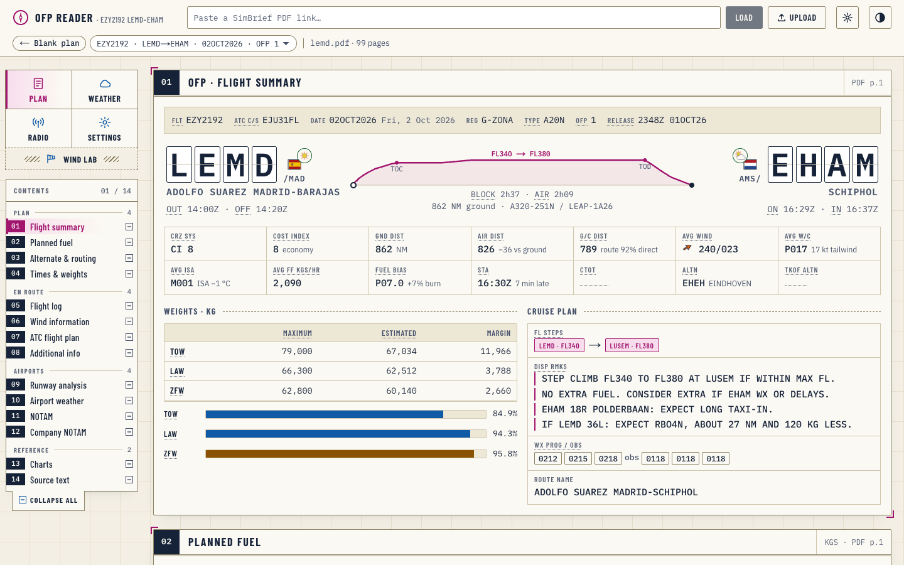
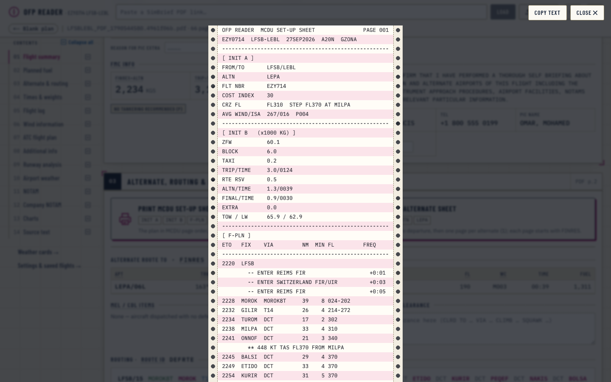
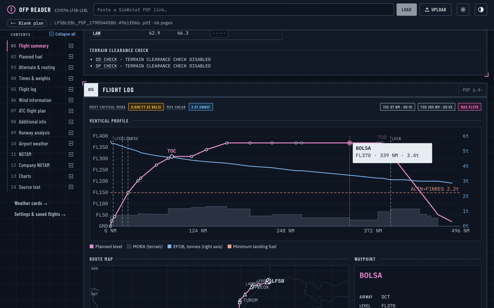
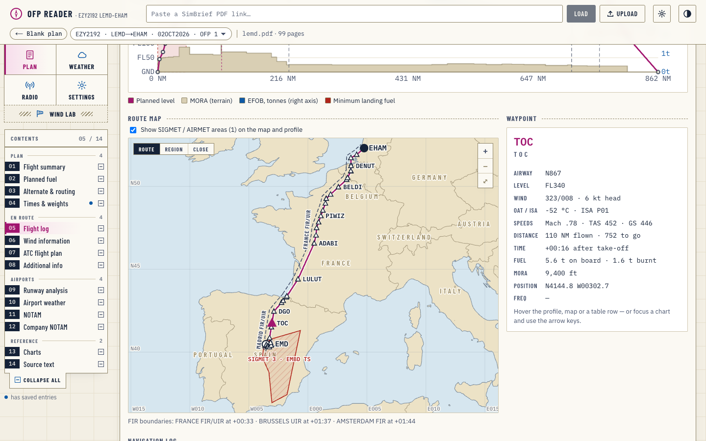
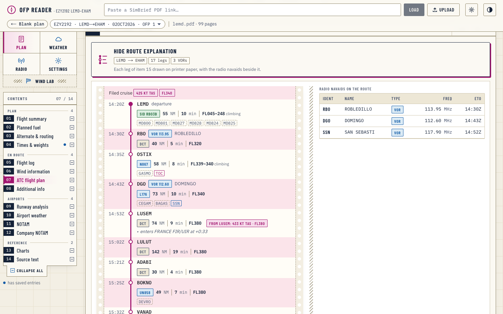
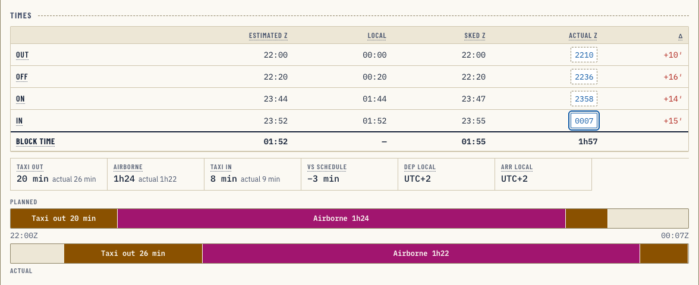
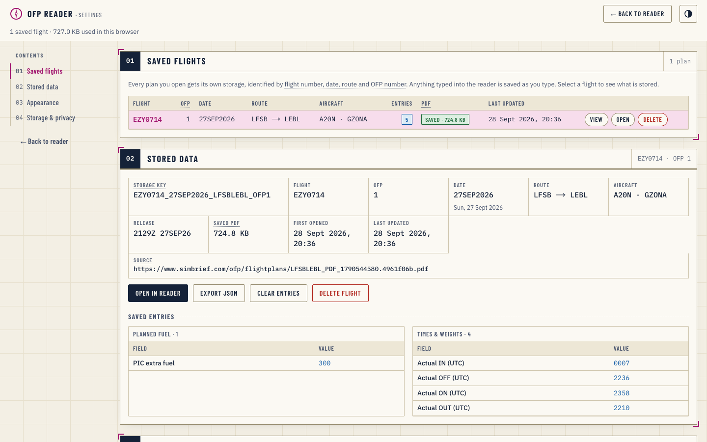
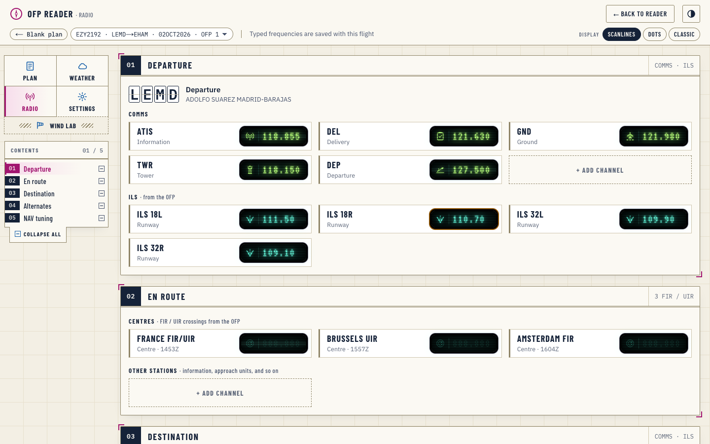
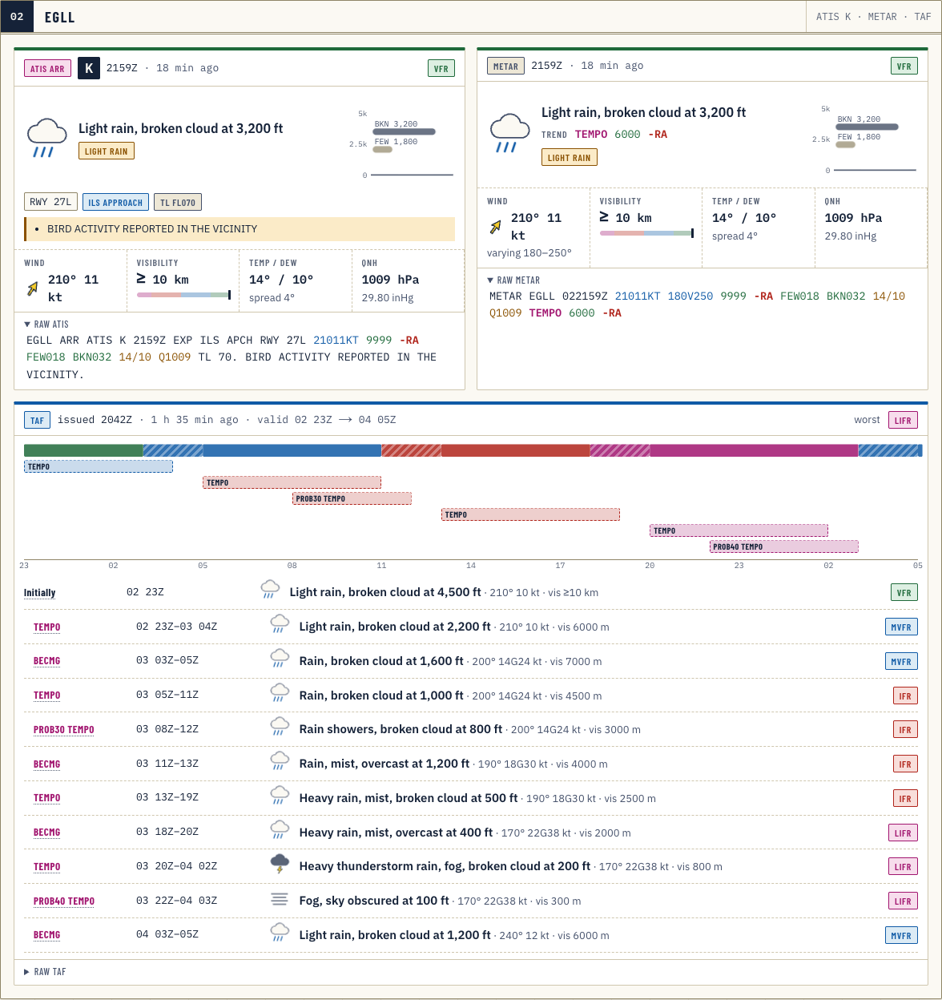

<div align="center">

# ✈︎ OFP Reader

**Turn a SimBrief operational flight plan into an interactive pilot chart, right in your browser.**

Paste a SimBrief PDF link or drop the file. The plan is decoded locally, laid out in the same order as the OFP,
and every value gets context: derived margins, decoded weather, a vertical profile, a route map and fillable actuals.



</div>

---

## Contents

- [Highlights](#highlights)
- [Screenshots](#screenshots)
- [Getting started](#getting-started)
- [Using it](#using-it)
- [How it works](#how-it-works)
- [Saved data](#saved-data)
- [Project structure](#project-structure)
- [Accessibility](#accessibility)
- [Limitations](#limitations)
- [Disclaimer](#disclaimer)

## Highlights

- **No server, no uploads.** The PDF is fetched straight from SimBrief (which allows cross-origin requests) or read from a local file, then parsed with [pdf.js](https://mozilla.github.io/pdf.js/) in the browser. The app is a static site.
- **Every section of the OFP, in OFP order.** Summary, fuel, alternate & routing, times & weights, flight log, winds, ICAO flight plan, runway analysis (TLR), airport weather, NOTAMs, company NOTAMs, the attached charts, and the full source text.
- **A blank form first.** On load you see the whole plan as an unfilled template; values ink in as the PDF is decoded, the airport codes flip in on split-flap tiles, and the flight graphic draws in from left to right.
- **Smart, not just pretty.**
  - Fuel: block composition bar, landing fuel, margin above ALTN + FINRES, endurance, burn per NM, PIC extra → total fuel.
  - Fuel en-route alternate: when the plan nominates one for its contingency fuel, it's named with the fuel it covers, where the route passes closest and when, the forecast then, a marker on the route map and its own alternate-sheet page.
  - Weights: max vs estimated gauges, and whether the take-off weight is actually landing-weight limited.
  - Times: taxi / airborne / block durations, local UTC offsets, and a **planned vs actual timeline** on a shared clock.
  - Flight log: vertical profile with MORA terrain, fuel on board and minimum-fuel line, a route map from the waypoint coordinates (blue sea, parchment land, country names, FIR stretches beside the route with boundary marks, zoom; with contours, without, or as a height map), FIR crossings, and a navigation log where ETOs follow your actual take-off time (or a RETO column from the Actual OFF in Times & weights).
  - PIC extra: switch it into the nav log to get a **TFOB** column (and profile line): EFOB plus the extra still on board, less the cost of carrying it, taken from the OFP's own weight-change impact.
  - Runway analysis: V-speed cards, FLEX, head- and crosswind components for the planned runway, and factored landing distance against runway length. Mark the runway you actually used to get its wind components, limits and margins, and an estimated landing distance when it isn't the planned one.
  - Weather: each airport's METAR and TAF as weather cards (sky picture, wind, visibility, cloud layers, TAF timeline by flight category), decoded token by token with hazard flags, plus a forecast badge on the summary flags for take-off and landing time.
  - Wind: AVG WIND, PWIND and METAR arrows sway like a windsock (faster with more wind, wider and irregular with gusts) and are coloured by strength, calm → storm.
  - NOTAMs: search, category filters, "critical" (CLSD, U/S, NOT AVBL…) and "mentions my planned runway" filters.
- **Hover (or focus) to learn.** Almost every label explains itself: OFP abbreviations, ICAO equipment and PBN codes, METAR groups, TLR columns.
- **Fill it in as you fly.** Actual times, weights, ATIS, clearance, RVSM check, ATO / AFOB per waypoint (one click stamps the time now or accepts the predicted fuel), TLR actuals: all saved per flight in your browser.
- **One plan across every page.** The plan you open is the active flight on the reader, Weather, Radio and Settings; switch it from the flight chip on any page (or Blank plan to close it), and other open tabs follow.
- **Reopens instantly, even after SimBrief expires it.** Each PDF is kept locally, so returning to a plan (same link, reload, the flight chip or Settings) doesn't download it again. SimBrief only keeps OFP PDFs for a limited time, so the saved copy is often the only one left.
- **Printouts for the flight deck.** An MCDU set-up sheet (INIT A, INIT B, F-PLN, PERF TAKE OFF, RAD NAV, winds) and an alternate sheet (return to departure, then one page per alternate, each starting with FINRES), printed line by line on continuous-form paper, with Copy text.
- **ATC flight plan, explained.** Decoded into flight, aircraft, route & times and capability cards, and the route drawn leg by leg on printer paper with the VOR / NDB frequencies beside it.
- **SIGMETs on your route.** Each SIGMET / AIRMET decoded and checked against your route, levels and times, drawn on the route map and profile.
- **Radio frequencies.** A Radio page (`/radio`) for planning the flight's frequencies: type each airport's ATIS / DEL / GND / TWR / APP and each FIR's centre into radio-panel windows (checked for the COMMS band and 8.33 kHz channels), add your own stations, and get the OFP's ILS per runway plus a NAV tuning sequence in flight order (departure ILS or the reciprocal for a return, each VOR / NDB with its ETO and Morse ident, the landing ILS).
- **Weather cards.** A separate page (`/weather`) turns pasted METARs, TAFs and ATIS (coded or plain language), or a saved plan's weather, into cards: sky picture, wind, visibility, cloud layers, TAF timeline by flight category, ATIS letter, runways and notices.
- **Your layout.** Collapse any section (or all of them) from its header or the Contents rail; it stays the way you left it. Pick the flight summary graphic: vertical profile, profile + times, route silhouette, progress timeline or classic arc.
- **A manual.** `/manual` explains where every piece of the OFP is in the reader and on paper, with quick-reference workflows for each phase of flight, worked examples, and a searchable glossary.
- **Day and night themes**, both meeting WCAG AA contrast.

## Screenshots

| MCDU set-up sheet | Flight log (night theme) |
| --- | --- |
|  |  |

| Route map & waypoint | Explain route & navaids |
| --- | --- |
|  |  |

| Planned vs actual timeline | Settings & saved flights |
| --- | --- |
|  |  |

**Radio page**



**Weather cards page**



## Getting started

Requires **Node 20+** and **pnpm**.

```bash
pnpm install
pnpm dev          # http://localhost:3000
```

Production build (a fully static site in `./out`, deployable to any static host):

```bash
pnpm build
```

| Script | What it does |
| --- | --- |
| `pnpm dev` | Dev server (copies the pdf.js worker into `public/` first) |
| `pnpm build` | Static export to `out/` |
| `pnpm lint` | ESLint |
| `pnpm typecheck` | TypeScript, no emit |

### Docker

The `Dockerfile` builds the static export and serves it with nginx on port 80 (`nginx.conf` maps `/settings` → `settings.html` and serves the `.mjs` pdf.js worker with a JavaScript MIME type):

```bash
docker build -t ofp-reader .
docker run -p 8080:80 ofp-reader   # http://localhost:8080
```

Live at **[charts.massorbit.co.uk](https://charts.massorbit.co.uk)**, deployed with Dokploy from `main`.

> To open the dev server from another device on your network, add its address to `allowedDevOrigins` in `next.config.ts`.

## Using it

| To… | Do this |
| --- | --- |
| Load a plan | Paste a SimBrief PDF link and press **Load**, click **Upload**, or drop a PDF anywhere on the page |
| Share or bookmark a plan | Use the address bar: `/?ofp=<simbrief pdf url>` |
| Reopen a saved plan | Click a **Recent** chip, or **Open** in Settings (`/?flight=<id>`) |
| Get a fresh copy from SimBrief | **Re-download** in the status row (only while SimBrief still has the OFP) |
| See fuel with PIC extra | Enter **PIC extra** in Planned fuel, then switch on **Include PIC extra** in the nav log |
| Start over | **← Blank plan** |
| Inspect a waypoint | Hover the profile, map or a nav-log row, or focus a chart and use the arrow keys |
| Hide sections | Click a section's header, or the ⊟ boxes / **Collapse all** in Contents |
| Change the summary graphic | ⚙ **Settings → Appearance** |
| Manage saved data | ⚙ **Settings**: saved flights, stored entries, export / import JSON, delete, theme |
| Read METARs, TAFs or ATIS as cards | **Weather cards →** in Contents (`/weather`): paste reports, or pick a saved plan |

## How it works

```
PDF (link or file)
   │  pdf.js: text items with x/y positions
   ▼
lines.ts   snaps every item to the OFP's fixed-pitch character grid → exact columns
   ▼
parse.ts   splits by [ OFP ] / [ NOTAM ] … headers and parses each block → typed model (types.ts)
   ▼
sections/* one React component per OFP section, in PDF order
```

- SimBrief OFPs are typeset in a monospaced font, so rebuilding the character grid recovers the original columns exactly. The flight log, for example, is read by column position rather than by guessing at whitespace.
- Image-only pages (route map, wind charts, cross-section) are rendered to canvas, auto-cropped, and shown in the **Charts** section.
- The **Source text** section keeps every extracted line, searchable, so nothing on the OFP is lost even where the parser has no dedicated view.

## Saved data

Everything stays in the browser. Nothing is sent anywhere.

| What | Where | Key |
| --- | --- | --- |
| Form entries + flight details | `localStorage` | `ofp-reader:flight:<id>` (index: `ofp-reader:flights`) |
| The PDF itself | IndexedDB `ofp-reader` → `pdfs` | `<id>` |
| Theme preference | `localStorage` | `ofp-theme` |
| Collapsed sections | `localStorage` | `ofp-reader:collapsed` |
| Summary graphic style | `localStorage` | `ofp-reader:strip` |
| Text pasted on the weather page | `localStorage` | `ofp-reader:wx-input` |

**One record per flight plan.** The id is `FLIGHT_DATE_ROUTE_OFPn`, e.g. `EZY0714_27SEP2026_LFSBLEBL_OFP1`. Flight numbers repeat daily, so the date and route are part of the key, and each re-release (new OFP number) gets its own storage. Plans without a flight or OFP number fall back to a fingerprint of the OFP's first page, which includes the release time.

Clearing site data or using a private window removes everything; **Export JSON** in Settings keeps a copy, and **Import JSON** brings it back (in this or another browser).

## Project structure

```
src/
├── app/
│   ├── layout.tsx            fonts, theme + collapsed-section boot scripts, footer
│   ├── page.tsx              reader
│   ├── settings/page.tsx     settings
│   ├── weather/page.tsx      weather cards
│   ├── wind-lab/             tuning page for the wind-arrow sway (not linked)
│   └── globals.css           design tokens (day / night) and all styles
├── components/
│   ├── OfpApp.tsx            loading, status row, form state
│   ├── SettingsApp.tsx       saved flights, stored data, appearance, storage
│   ├── WeatherApp.tsx        weather cards page
│   ├── WindArrow.tsx         swaying, category-coloured wind arrow
│   ├── chrome.tsx            brand, theme toggle, contents rail
│   ├── collapse.tsx          collapsible-section state, Collapse all
│   ├── FlightStrip.tsx       summary graphic (profile, times, route, timeline, arc)
│   ├── FlapCode.tsx          split-flap airport codes
│   ├── SiteFooter.tsx        build-info footer
│   ├── TooltipLayer.tsx      one floating tooltip for every [data-tip]
│   ├── ui.tsx                Section, Field, V (value / blank), Tip, Gauge, Act (input)
│   ├── context.tsx           OFP + saved-field contexts (useField)
│   └── sections/             Summary, Fuel, Route, TimesWeights, FlightLog, Winds,
│                             Fpl, Additional, Tlr, Wx, Notams, Charts, Source
└── lib/
    ├── ofp/
    │   ├── lines.ts          pdf.js items → monospaced lines
    │   ├── parse.ts          lines → OFP model
    │   ├── types.ts          the OFP model
    │   ├── pdf.ts            fetch / read / chart rendering (browser)
    │   ├── metar.ts          METAR / TAF decoding, flight category, wind components
    │   ├── glossary.ts       tooltip text, ICAO equipment / PBN tables
    │   ├── icaoCountry.ts    ICAO prefix → country (for flags)
    │   ├── picExtra.ts       PIC extra / TFOB model
    │   └── format.ts         time, number and unit helpers
    ├── wind/                 wind-arrow sway engine and model (shared with the wind lab)
    ├── wx/reports.ts         METAR / TAF / ATIS → structured reports for the cards
    ├── outlines.ts           coastline / border outlines for the route map
    ├── storage.ts            per-flight localStorage records
    ├── stripPref.ts          summary graphic preference
    ├── build-info.ts         version / commit / dirty flag for the footer
    └── pdfCache.ts           per-flight PDF copies in IndexedDB
```

**Stack:** Next.js 16 (static export) · React 19 · TypeScript · pdf.js 6 · [flag-icons](https://github.com/lipis/flag-icons) (MIT) for country flags · [Natural Earth](https://www.naturalearthdata.com/) (public domain, via [world-atlas](https://github.com/topojson/world-atlas)) for map outlines. [OurAirports](https://ourairports.com/data/) (public domain) for airport positions. No UI framework; styles are plain CSS with design tokens.

## Accessibility

- Every text / background pair meets **WCAG AA (≥ 4.5 : 1)** in both themes.
- Tooltips open on hover *and* keyboard focus; the same text is exposed to screen readers via `aria-describedby`.
- Charts are keyboard-operable (arrow keys, Home / End, Esc) with a live waypoint readout.
- Works down to phone width without horizontal scrolling; respects `prefers-reduced-motion`.

## Limitations

- Built and tested against SimBrief's airline-style (LIDO) OFP layout. Other layouts will only partly fill the structured views; the Source text section still shows everything.
- The TLR's planned-takeoff line prints V-speeds with the hundreds digit dropped (`61` for 161 kt). The reader restores it and shows what was printed.
- Landing distances in the TLR have no printed unit; they're treated as feet, matching the runway lengths.

## Disclaimer

For flight simulation only. **Not for real-world navigation.** Not affiliated with SimBrief or Navigraph.

---

<sub>© Mohamed Omar. All rights reserved.</sub>
